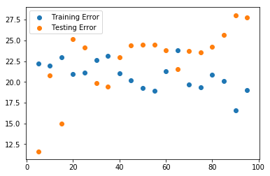

# Regression Model Validation - Lab

## Introduction

In this lab, you'll be able to validate your model using train-test-split.


## Objectives

You will be able to:

- Calculate the mean squared error (MSE) as a measure of predictive performance
- Validate the model using the test data


## Let's use our Boston Housing Data again!

This time, let's only include the variables that were previously selected using recursive feature elimination. We included the code to preprocess below.


```python
import pandas as pd
import numpy as np
import matplotlib.pyplot as plt
%matplotlib inline
from sklearn.datasets import load_boston

boston = load_boston()

boston_features = pd.DataFrame(boston.data, columns = boston.feature_names)
b = boston_features["B"]
logdis = np.log(boston_features["DIS"])
loglstat = np.log(boston_features["LSTAT"])

# minmax scaling
boston_features["B"] = (b-min(b))/(max(b)-min(b))
boston_features["DIS"] = (logdis-min(logdis))/(max(logdis)-min(logdis))

#standardization
boston_features["LSTAT"] = (loglstat-np.mean(loglstat))/np.sqrt(np.var(loglstat))
```


```python
X = boston_features[['CHAS', 'RM', 'DIS', 'B', 'LSTAT']]
y = boston.target
```

## Perform a train-test-split


```python
from sklearn.model_selection import train_test_split
x_train, x_test, y_train, y_test = train_test_split(X, y, test_size=0.2)
```


```python
print(len(x_train), len(x_test), len(y_train), len(y_test))
```

    404 102 404 102


## Apply your model to the train set

#### Importing and initializing the model class


```python
from sklearn.linear_model import LinearRegression
linreg = LinearRegression()
```

#### Fitting the model to the train data


```python
model = linreg.fit(x_train, y_train)
```

#### Calculating predictions on the train set, and on the test set


```python
y_train_hat = model.predict(x_train)
y_test_hat = model.predict(x_test)
n_train = len(y_train)
n_test = len(y_test)
```

#### Calculating your residuals


```python
mse_train = sum((y_train - y_train_hat) ** 2) / n_train
rmse_train = np.sqrt(mse_train)

mse_test = sum((y_test - y_test_hat) ** 2) / n_test
rmse_test = np.sqrt(mse_test)
```


```python
def mse(y, y_hat):
    return sum((y - y_hat) ** 2) / len(y)
def rmse(mse):
    return np.sqrt(mse)
```

#### Calculating the Mean Squared Error
A good way to compare overall performance is to compare the mean squarred error for the predicted values on the train and test sets.


```python
print(mse_train, rmse_train, mse_test, rmse_test)
```

    21.561323248336336 4.6434171951630985 22.236613524100402 4.715571388930551


```python
from sklearn.metrics import mean_squared_error
```

If your test error is substantially worse then our train error, this is a sign that our model doesn't generalize well to future cases.

One simple way to demonstrate overfitting and underfitting is to alter the size of our train test split. By default, scikit learn's built in method allocates 25% of the data to the test set and 75% to the training set. Fitting a model on only 10% of the data is apt to lead to underfitting, while training a model on 99% of the data is apt to lead to overfitting.

# Evaluating the effect of train-test split size

Iterate over a range of train-test split sizes from .5 to .95. For each of these, generate a new train/test split sample. Fit a model to the training sample and calculate both the training error and the test error (mse) for each of these splits. Plot these two curves (train error vs. training size and test error vs. training size) on a graph.


```python
import random
random.seed(11)
split_sizes = list(range(5,100,5))
training_errors = []
test_errors = []
for size in split_sizes: 
    x_train, x_test, y_train, y_test = train_test_split(X, y, test_size=size/100)
    print(len(x_train), len(x_test), len(y_train), len(y_test))
    linreg = LinearRegression().fit(x_train, y_train)
    
    y_train_hat = linreg.predict(x_train)
    mse_train = mean_squared_error(y_train, y_train_hat)
    training_errors.append(mse_train)
    test_errors.append( mean_squared_error(y_test, linreg.predict(x_test)))

```

    480 26 480 26
    455 51 455 51
    430 76 430 76
    404 102 404 102
    379 127 379 127
    354 152 354 152
    328 178 328 178
    303 203 303 203
    278 228 278 228
    253 253 253 253
    227 279 227 279
    202 304 202 304
    177 329 177 329
    151 355 151 355
    126 380 126 380
    101 405 101 405
    75 431 75 431
    50 456 50 456
    25 481 25 481


```python
fig = plt.figure()
plt.scatter(split_sizes,training_errors, label='Training Error')
plt.scatter(split_sizes,test_errors,  label='Test Error')
plt.legend()
plt.show()
```


```python

```


    <matplotlib.legend.Legend at 0x1a24d6cef0>





# Evaluating the effect of train-test split size: extension

Repeat the previous example, but for each train-test split size, generate 100 iterations of models/errors and save the average train/test error. This will help account for any particularly good/bad models that might have resulted from poor/good splits in the data. 


```python
import random
random.seed(8)
split_sizes = list(range(5,100,5))
training_errors = []
test_errors = []

for size in split_sizes:
    temp_train_err = []
    temp_test_err = []
    
    for i in range(0,100):

        #create splits and train
        x_train, x_test, y_train, y_test = train_test_split(X, y, test_size=size/100)
        linreg = LinearRegression().fit(x_train, y_train)
        
        #calculate mse on train and test
        y_train_hat = linreg.predict(x_train)
        mse_train = mean_squared_error(y_train, y_train_hat)
        temp_train_err.append(mse_train)
        temp_test_err.append( mean_squared_error(y_test, linreg.predict(x_test)))
    
    #average errors over 100 iterations for this split size
    training_errors.append(np.mean(temp_train_err))
    test_errors.append(np.mean(temp_test_err))
```


```python
fig = plt.figure()
plt.scatter(split_sizes,training_errors, label='Training Error')
plt.scatter(split_sizes,test_errors,  label='Test Error')
plt.legend()
plt.show()
```


```python

```


    <matplotlib.legend.Legend at 0x1a26e93438>


What's happening here? evaluate your result!

Start to overfit on training data and doesn't generalize well.

##  Summary 

Congratulations! You now practiced your knowledge on MSE and on using train-test-split.
